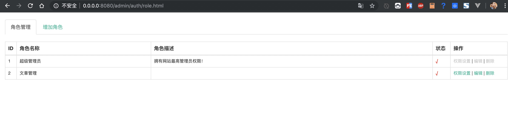

# think-rbac
## 版权及用途说明
基于 zouxiang0639/thinkcms-auth 制作，供个人或公司使用，其他人员请谨慎使用，不维护他人需求或bug

## v0.0.1 使用说明
 1. 执行命令 `composer require hainuo/think-rbac` 安装类库
 2. 首先安装数据库 没有做自动安装功能，后续看业务需求
 3. 在管理模块例如`admin`下的控制器中新增一个控制器，控制器的名字必须为`Auth`
    
    1. 文件结构类似下面 
        ```shell
         ├── admin
         │   ├── controller
         │   │   ├── AdminBase.php
         │   │   ├── Auth.php
         │   └── view
        ```
    2. Auth.php内容如下
        ```php
        namespace app\admin\controller;
        class Auth extends AdminBase
        {
            public function _empty($name)
            {
                $auth = new \think\auth\Auth();
                $auth = $auth->autoload($name);
                if ($auth) {
                    if (isset($auth['code'])) {
                        return json($auth);
                    } elseif (isset($auth['file'])) {
                        return $auth['file'];
                    }
                    $this->view->engine->layout(false);
                    return $this->fetch($auth[0], $auth[1]);
                }
                return abort(404, '页面不存在');
            }
        }
        ```
 4. 管理访问  基于上述admin的访问路径
     ```html
    /admin/auth/role.html 角色列表
    /admin/auth/roleAdd.html 角色添加
    /admin/auth/roleEdit.html 角色修改
    /admin/auth/authorize/id/2.html 权限设置
    /admin/auth/menu.html 菜单列表
    /admin/auth/menuAdd.html 菜单增加
    /admin/auth/menuEdit.html 菜单修改
    /admin/auth/log.html 行为日志 新v1.1
    /admin/auth/viewLog.html 查看日志 新v1.1
    /admin/auth/clear.html 清空日志 新v1.1
    /admin/auth/adminAuthorize.html 独立权限 新v1.1.2
    ```
    > ps: 注意这里跟 数据库中的配置是有区别的数据库中 配置的模块名可能是index所以 需要你在合适的时候自行更改一下数据库中的内容
  
  5. 直接按照`4`中的地址进行访问的时候会报错 原因是 无法获取到用户信息 所以我们需要在 `Auth.php` 中定义一个`超级用户` 信息。我们可以在`Autho.php` 增加一个初始化方法来解决这个问题。代码如下
      ```php
       public function _initialize()
          {
              parent::_initialize(); // TODO: Change the autogenerated stub
              session('user',['uid'=>1]);
          }
      ```
  6. 可以看到下图了
  
  7. 关于权限校验 可以在基类控制器中增加以下方法
  ```php
      public function __construct()
      {
          parent::__construct();
          $auth                   = new Auth();
          $auth->noNeedCheckRules = ['index/index/index','index/index/home'];
          $auth->log              = true;                 // v1.1版本  日志开关默认true
          $user                   = $auth::is_login();

          if($user){//用户登录状态
              $this->uid = $user['uid'];
              if(!$auth->auth()){
                  return $this->error("你没有权限访问！");
              }
          }else{
              return $this->error("您还没有登录！",url("publics/login"));
          }
      }
      ```
 8. 其他的参照原版 唯一需要做的就是命名空间的变化
  
##  v0.0.1 版本 变更说明
1. 目录优化  所有有效文件目录存放在src目录下
2. 更新明明空间 thinkcms为think 使之更具有通用性
3. 提交新的packgist 以被公司他人使用，同时可以供网友参考使用

#以下是原版的说明  
# thinkphp5 权限认证 RBAC 加 行为日志
这个插件主要有一整套RBAC  行为日志 视图 只需要 composer安装即可和你的系统融为一体

## 安装
~~~
> composer require zouxiang0639/thinkcms-auth
~~~
## v1.1更新
* 1.加入了行为日志
* 2.加入样式文件路由定义,

## v1.1.1新加入方法
~~~
is_login()                              判断是否登录
login($uid 用户ID,$nickname 用户昵称)    用户登录
logout()                               用户退出
checkPath($path 路由,$param 参数)       检查路由是否有权限
~~~

## 配置 v1.1
~~~
'thinkcms' =>[
        'style_directory' => '/static/admin/',
        'session_prefix'  => 'abc_',
  ]
~~~


可以不配置  配置以后Js css文件需要放到配置的目录里

## 手动加入日志  v1.1
~~~
    $auth = new Auth();
    $auth->admin = $list['user_name'];
    $auth->createLog('管理员<spen style=\'color: #1dd2af;\'>[ {name} ]</spen>偷偷的进入后台了,','后台登录');
~~~

## 视图调用
~~~
     public function _empty($name)
        {
            $auth =  new \thinkcms\auth\Auth();
            $auth = $auth->autoload($name);
            if($auth){
                if(isset($auth['code'])){
                    return json($auth);
                }elseif(isset($auth['file'])){
                    return $auth['file'];
                }
                $this->view->engine->layout(false);
                return $this->fetch($auth[0],$auth[1]);
            }
            return abort(404,'页面不存在');
        }
~~~
在模块中创建一个Auth控制器，把_empty方法复制上去，这样就可以访问以下视图

* /auth/role.html           角色列表
* /auth/roleAdd.html        角色添加
* /auth/roleEdit.html       角色修改
* /auth/authorize/id/2.html 权限设置
* /auth/menu.html           菜单列表
* /auth/menuAdd.html        菜单增加
* /auth/menuEdit.html       菜单修改
* /auth/log.html            行为日志    新v1.1
* /auth/viewLog.html        查看日志    新v1.1
* /auth/clear.html          清空日志    新v1.1
* /auth/adminAuthorize.html 独立权限    新v1.1.2

## 权限认证
~~~
     public function __construct()
        {
            parent::__construct();
            $auth                   = new Auth();
            $auth->noNeedCheckRules = ['index/index/index','index/index/home'];
            $auth->log              = true;                 // v1.1版本  日志开关默认true
            $user                   = $auth::is_login();

            if($user){//用户登录状态
                $this->uid = $user['uid'];
                if(!$auth->auth()){
                    return $this->error("你没有权限访问！");
                }
            }else{
                return $this->error("您还没有登录！",url("publics/login"));
            }
        }
~~~
这里在公共控制器上加入验证即可

##管理员独立权限
~~~
 url('auth/adminAuthorize',['id' => '用户ID','name'=>'用户昵称'])
~~~
## 授权菜单
~~~
 Auth::menuCheck();
~~~
这个方法返回授权及非隐藏的所有菜单，这样我们后台的菜单就可以根据管理员的权限来来展示授权的目录 


## mysql文件
~~~
tp_action_log.sql
tp_auth_access.sql
tp_auth_role.sql
tp_auth_role_user.sql
tp_auth_rule.sql
tp_menu.sql
~~~

案例下载(http://www.thinkphp.cn/extend/875.html)
